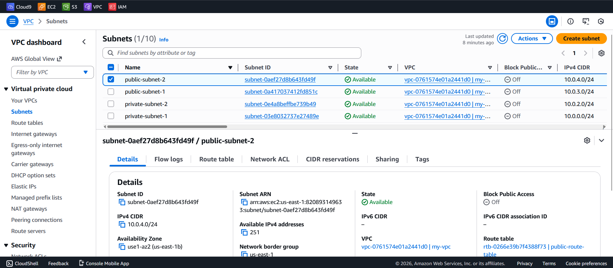

# AWS VPC Hands-On Lab

## Objective
Design and implement a Virtual Private Cloud (VPC) with public and private subnets.

## Architecture Created
- **VPC CIDR:** `10.0.0.0/16`
- **Public Subnets:** (For internet-facing resources)
  - `public-subnet-1`: `10.0.2.0/24` (us-east-1a)
  - `public-subnet-2`: `10.0.3.0/24` (us-east-1b)
- **Private Subnets:** (For internal resources)
  - `private-subnet-1`: `10.0.0.0/24` (us-east-1a)
  - `private-subnet-2`: `10.0.4.0/24` (us-east-1b)
- **Internet Gateway:** `igw-097a13f0b8c69719d` (Attached to VPC)
- **Route Tables:**
  - Public Route Table: Routes `0.0.0.0/0` → Internet Gateway
  - Private Route Table: Routes `10.0.0.0/16` → Local (only VPC internal)

## Steps Performed

### 1. VPC Creation
- Created VPC with CIDR `10.0.0.0/16`
- Enabled DNS hostnames and DNS resolution

### 2. Subnet Design
- Created 4 subnets across 2 availability zones
- Public subnets have auto-assign public IPv4 enabled
- Private subnets have auto-assign public IPv4 disabled

### 3. Internet Gateway
- Created and attached Internet Gateway to VPC
- Allows internet access for public subnets

### 4. Route Table Configuration
- **Public Route Table:**
  - Route: `10.0.0.0/16` → local (VPC internal)
  - Route: `0.0.0.0/0` → Internet Gateway
  - Associated with: `public-subnet-1`, `public-subnet-2`

- **Private Route Table:**
  - Route: `10.0.0.0/16` → local (VPC internal)
  - Associated with: `private-subnet-1`, `private-subnet-2`

## Key Learnings
- **VPC** is your isolated network in AWS
- **Subnets** segment your network (public/private)
- **Internet Gateway** enables internet access for public subnets
- **Route Tables** control traffic flow between subnets and internet
- **AZ (Availability Zones)** provide fault tolerance
- **CIDR planning** is crucial for network design

## Screenshots

## Commands Used (via AWS Console)
- VPC creation wizard
- Subnet configuration
- Route table editing

## Real-World Application
This architecture mimics production environments where:
- Web servers go in public subnets
- Databases/app servers go in private subnets
- Internet Gateway provides controlled external access
- Multiple AZs ensure high availability
